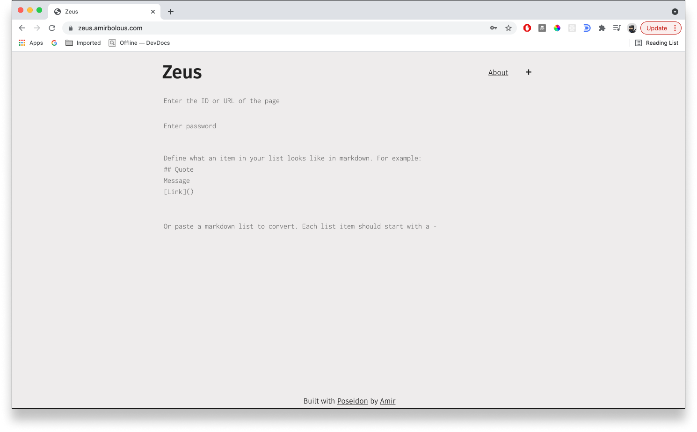
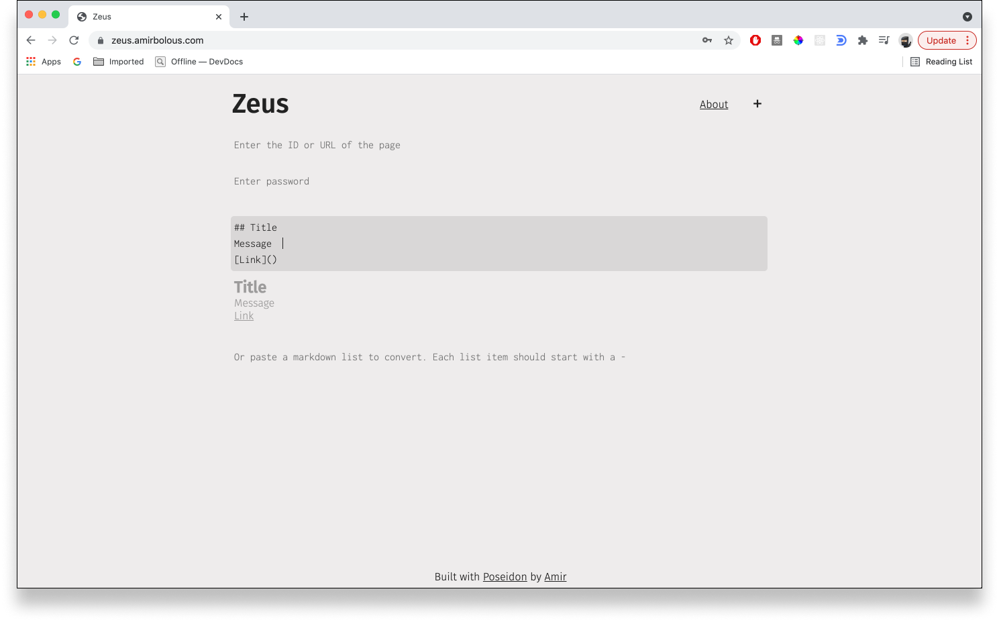
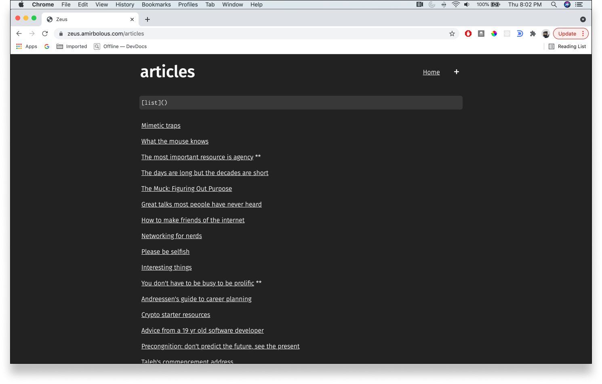
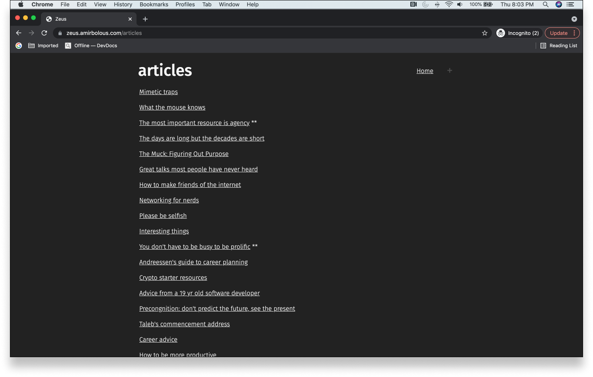

# Zeus
### Order from chaos
Create, store, and share lists like a boss.




### About
I store a lot of lists. Most of them are scattered, inaccessible, and hard to share. Zeus is an attempt at solving this. It allows me to create custom lists composed of markdown elements via a defined template. This means for more complex lists, adding new elements is very fast since Zeus will preload the markdown template. It tries to move lists away from just text line by line in some notepad to a more custom-tailored tool, which provides some structure while not compromising on how I want to store each item in a list.

Zeus comes with a minimalist, notebook style UI, and of course dark mode. It also lets you import a list directly from markdown text (which is how I kept most of lists in the past). 

### Technical Details
There are a couple of technical noteworthy components of Zeus to mention. The backend is written in Go which offers some endpoints for creating, updating, and retreiving lists. It also offers an endpoint to return markdown generated HTML from a string, which is used in the previews.

The frontend is written in [Poseidon](https://github.com/amirgamil/poseidon), composed of [home page](https://github.com/amirgamil/zeus/blob/master/static/js/main.js#L295) where you can add new lists (this is one component) and a [page](https://github.com/amirgamil/zeus/blob/master/static/js/main.js#L138) to dynamically load / edit a list, (which is the second large component). Most of routing is done on the client side which interacts with the database via a REST-like API - this ends up being a wrapper [component](https://github.com/amirgamil/zeus/blob/master/static/js/main.js#L489) which renders one of the above two components based on the relevant route.

Since we render markdown previews based on user-input, I sanitize any HTML before rendering it to secure the website against any risk of cross-site scripting (XSS) attacks which could inject and execute HTML code via markdown.

The database is a serialized Go hash map, which allows us for efficient, fast look-ups with minimum overhead for setting things up, and relatively efficiently encoded data (so small file sizes). I encode and decode using Go's excellent provided `gop` package.

Because I did not want to add a fully fledged auth layer, I keep a password saved in an env file. Once a user enters a correct/incorrect password, I save whether they have been authenticated or not via local storage. Based on that, I conditionally render whether a list should give a user the option to edit a page (i.e. via a markdown) or whether the page is only read-only (i.e. if I share a list publicly with a friend). 




#### Backend
On the backend, I store lists as a map of keys to a `struct List` which has the following structure
```go
type List struct {
	Key  string   `json:"key"` //represents the key or id of a page, this value acts as the route of the list
	Data []string `json:"data"` //data is stored as a list of string elements which are rendered markdown (so just string composed of HTML tags)
	Rule string `json:"rule"` //rule represents markdown of what a unit of the list looks like
}
```

### Future ideas
[ ] Have password-secured lists since all lists are publicly visible